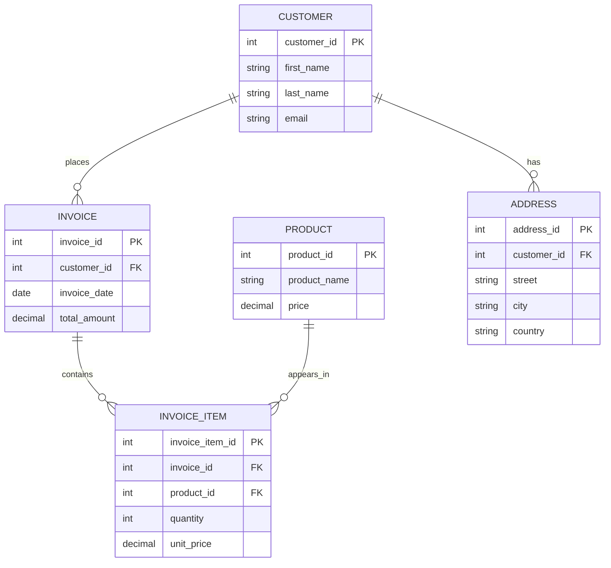
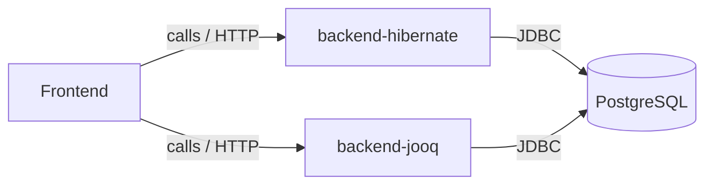
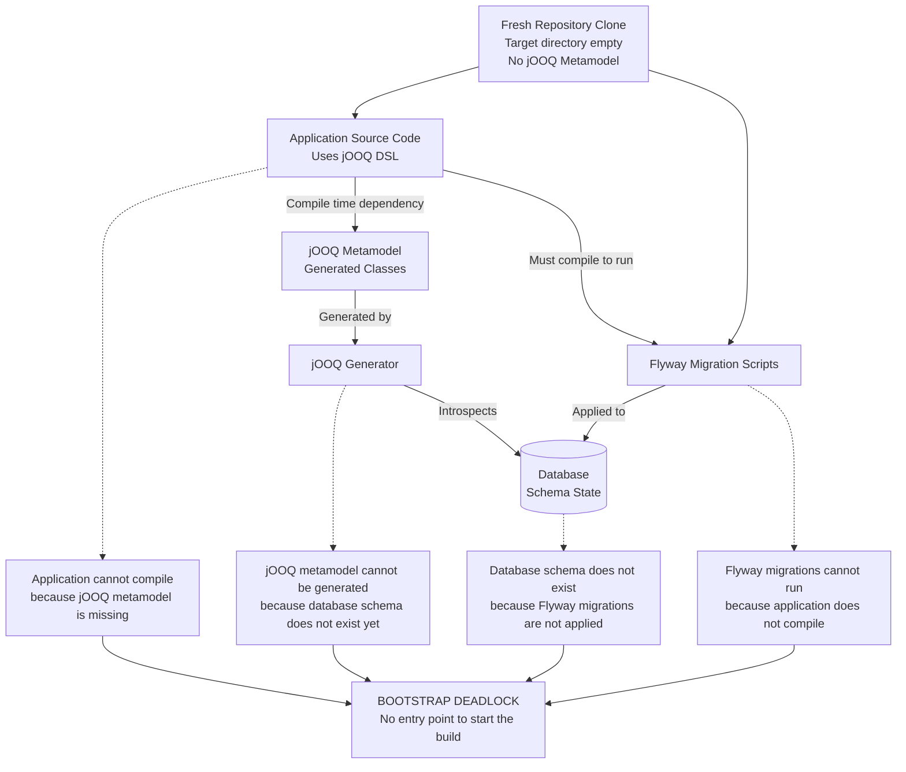

## Docker Compose Architecture

This diagram shows that the `frontend` service calls either `backend-hibernate` or `backend-jooq`, and both backends connect to the `PostgreSQL` database.

## Problem with JOOQ Metamodel

1. I want a easily buildable system with `mvn clean package`
2. To keep the metamodel up-to-date i would like to create the model every time i build.
Explained at (jooq.org)[https://www.jooq.org/doc/latest/manual/code-generation/codegen-version-control/#derived-artefacts].
3. Building the metamodel depends on a running database with all the flyway scripts applied.

This seems like a big problem, if i don't want to keep my metamodel (in the `target` folder), because
i can't startup my application without the metamodel-classes (build error).

Right now my solution is to add the metamodel to git. 😥