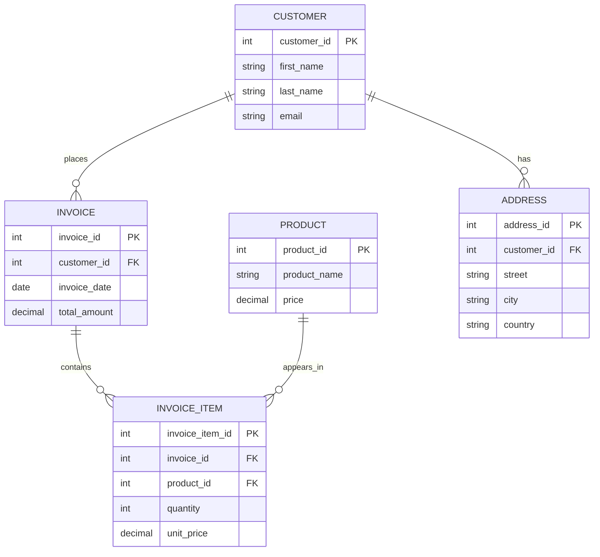

## Docker Compose Architecture

```mermaid
flowchart LR
        direction LR
        frontend[Frontend]
        backend_hibernate[backend-hibernate]
        backend_jooq[backend-jooq]
        postgres[(PostgreSQL)]
    end

    %% Frontend can call either backend
    frontend -->|calls / HTTP| backend_hibernate
    frontend -->|calls / HTTP| backend_jooq

    %% Backends contact the database
    backend_hibernate -->|JDBC| postgres
    backend_jooq -->|JDBC| postgres
```

This diagram shows that the `frontend` service calls either `backend-hibernate` or `backend-jooq`, and both backends connect to the `PostgreSQL` database.