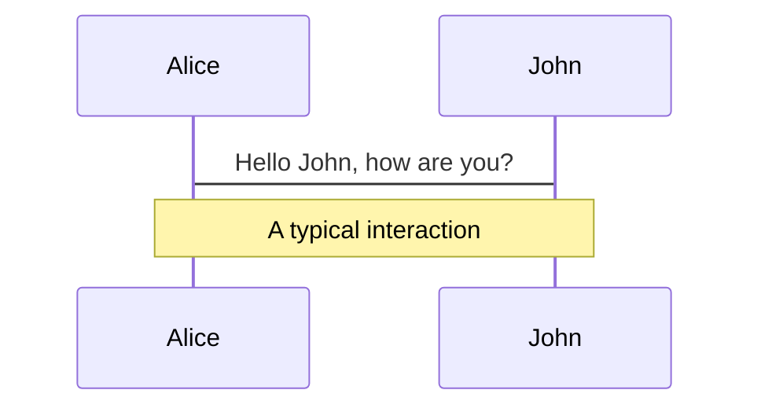
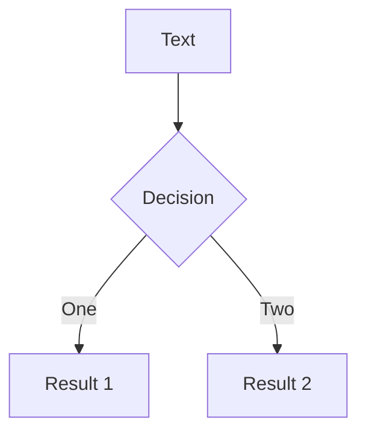
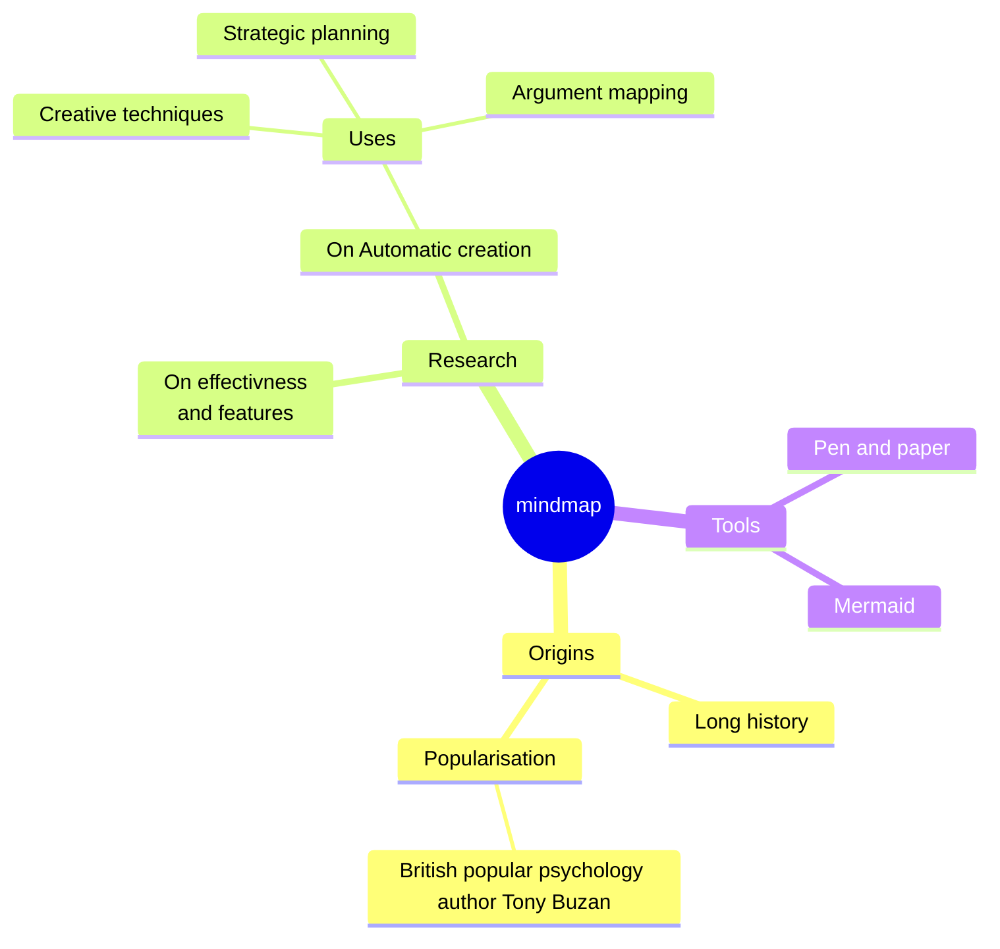
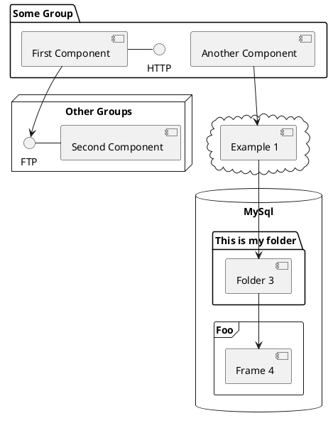

# jOOQ vs Hibernate ⚔️

> When "no SQL knowledge required" becomes a lie — pick predictability.

---

## TL;DR

- **Hibernate** promises to hide SQL and let you think in objects. ✅
- **jOOQ** exposes SQL as the primary API — you write real SQL, type-safe and composable. ✅

**Core point:** with Hibernate you eventually must understand SQL *and* what Hibernate does; with jOOQ you must understand SQL up front and there is far less magic.

---

## Outline

1. Why abstractions leak
2. Side-by-side examples
3. Debugging & performance
4. Testing & tooling
5. When to prefer jOOQ vs Hibernate

---

## 1) Why the abstraction leaks

- Hibernate abstracts SQL: object identity, lazy loading, flush, cascades, proxies, first-level cache, dirty checking 🔁
- These features are handy — but they add hidden lifecycle & side-effects.
- When queries or performance matter, you end up reading generated SQL and learning the same SQL you tried to avoid.

> The promise "you don't need to know SQL" turns false fast for non-trivial apps.

---

## 2) Side-by-side: simple read

<div grid="~ cols-2 gap-6">
<div>

### Hibernate (JPQL / repository)

```java
List<Order> orders = em.createQuery(
  "select o from Order o join fetch o.items where o.customer.id = :id", Order.class)
  .setParameter("id", customerId)
  .getResultList();
```

- Pros: object graph returned
- Cons: must know fetch strategy to avoid N+1

</div>
<div>

### jOOQ (SQL first)

```java
var r = ctx.select()
  .from(ORDERS)
  .join(ORDER_ITEMS).on(ORDER_ITEMS.ORDER_ID.eq(ORDERS.ID))
  .where(ORDERS.CUSTOMER_ID.eq(customerId))
  .fetch();

// Map rows explicitly to DTOs
```

- Pros: explicit SQL => known joins/rows
- Cons: you write SQL (but it's type-safe and composable)

</div>
</div>

---

## 2b) Side-by-side: create invoice with items

<div grid="~ cols-2 gap-6">
<div>

### Hibernate (cascades & entity graph)

```java
Invoice invoice = new Invoice();
invoice.setCustomer(customer);
invoice.addItem(new InvoiceItem(...));
em.persist(invoice);
// Hidden work: order of SQL, generated keys, flush timing
```

- Magic: cascade persist, flush on transaction.commit()
- Problem: implicit multiple statements, surprising order

</div>
<div>

### jOOQ (explicit inserts)

```java
var id = ctx.insertInto(INVOICE)
  .columns(INVOICE.CUSTOMER_ID, INVOICE.TOTAL)
  .values(customerId, total)
  .returning(INVOICE.ID)
  .fetchOne()
  .getId();

ctx.batchInsert(items.map(item ->
  DSL.insertInto(INVOICE_ITEM)
     .set(INVOICE_ITEM.INVOICE_ID, id)
     ...)).execute();
```

- Everything is explicit: 1 insert for invoice, then batch for items
- No hidden flush/ordering surprises

</div>
</div>

---

## 3) Debugging & performance ⚠️

- Hibernate issues you will encounter:
  - N+1 selects (because of lazy collections)
  - Unexpected updates due to dirty checking
  - Session/transaction boundaries affecting results
  - Second-level cache causing stale results
- jOOQ gives you: precise SQL control — easier to reason about performance and index usage

> When performance debugging, reading a SQL statement beats chasing lifecycle bugs.

---

## 4) Testing & migrations 🧪

- With Hibernate you must test both mapping *and* ORM behavior (flush timing, cascades). Tests can be brittle to internal lifecycle assumptions.
- With jOOQ, tests are often more straightforward — assert SQL result sets / snapshots and DB state. Also pairs well with migrations (Flyway/Liquibase) because you test at the SQL level.

---

## 5) Tooling & maintainability

- jOOQ:
  - Auto-generated types from schema — IDE autocomplete for tables/columns
  - SQL is first-class — easier to reason about schema changes
  - No magic => easier code review for DB operations
- Hibernate:
  - Great for CRUD with simple domain logic
  - Hides complexity until it leaks — then you need deep ORM knowledge

---

## When to choose which? ✅

- Prefer **Hibernate** when:
  - You have simple CRUD, complex object graphs, and want rapid domain modeling
  - You benefit from automatic state management and cascading

- Prefer **jOOQ** when:
  - You need predictable SQL, complex queries, or performance-sensitive code
  - Your team is comfortable with SQL and wants explicit control

---

## Quick checklist for migration or greenfield decisions

- Do we need advanced SQL / performance tuning? → jOOQ
- Do we prefer object graph convenience and are OK debugging ORM quirks? → Hibernate
- Want deterministic behavior & easier debugging? → jOOQ

---

## Example: debugging N+1

.columns
.left[
Hibernate:
```java
for(Order o : orders) {
   System.out.println(o.getItems().size()); // triggers additional query per order
}
```
]
.right[
jOOQ:
```sql
SELECT o.id, i.* FROM orders o JOIN order_items i ON i.order_id = o.id
```

- jOOQ's SQL shows you the join — no surprises

---

## Final thought 💡

- ORM convenience can be a productivity win — until edge-cases make the abstraction cost more than its benefit.
- jOOQ forces you to learn SQL up front, trading off some convenience for clarity, control, and predictable performance.

---

# Thanks — Questions? ✨

> Slide source: `slidev/index.md` in the repo

---
transition: fade-out
---

# What is Slidev?

Slidev is a slide maker and accompanying presentation tool designed for developers. It consists of the following features:

- 📝 **Text-based** - focus on the content with Markdown, and apply styles later
- 🎨 **Themable** - themes can be shared and used as npm packages
- 🧑‍💻 **Developer Friendly** - code highlighting, live coding with autocompletion
- 🤹 **Interactive** - embedding Vue components to enhance your slides
- 🎥 **Recording** - built-in recording and camera view
- 📤 **Portable** - export to PDF, PPTX, PNGs, or even a hostable SPA
- 🛠 **Hackable** - virtually anything that's possible on a webpage is possible in Slidev

<br>
<br>

Read more about Slidev in [Why Slidev?](https://sli.dev/guide/why)

<!--
You can have `style` tags in markdown to override the style for the current page.
Learn more: https://sli.dev/guide/syntax#embedded-styles
-->

<style>
h1 {
  background-color: #2B90B6;
  background-image: linear-gradient(45deg, #4EC5D4 10%, #146b8c 20%);
  background-size: 100%;
  -webkit-background-clip: text;
  -moz-background-clip: text;
  -webkit-text-fill-color: transparent;
  -moz-text-fill-color: transparent;
}
</style>

<!--
Here is another comment.
-->

---
layout: default
---

# Table of contents

```html
<Toc minDepth="1" maxDepth="1"></Toc>
```

<Toc maxDepth="1"></Toc>

---
transition: slide-up
level: 2
---

# Navigation

Hover on the bottom-left corner to see the navigation's control panel, [learn more](https://sli.dev/guide/navigation.html)

## Keyboard Shortcuts

|     |     |
| --- | --- |
| <kbd>right</kbd> / <kbd>space</kbd>| next animation or slide |
| <kbd>left</kbd>  / <kbd>shift</kbd><kbd>space</kbd> | previous animation or slide |
| <kbd>up</kbd> | previous slide |
| <kbd>down</kbd> | next slide |

<!-- https://sli.dev/guide/animations.html#click-animation -->

<p v-after class="absolute bottom-23 left-45 opacity-30 transform -rotate-10">Here!</p>

---
layout: image-right
image: https://cover.sli.dev
---

# Code

Use code snippets and get automatic highlighting, and even types hover![^1]

```ts {all|5|7|7-8|10|all} twoslash
// TwoSlash enables TypeScript hover information
// and errors in markdown code blocks
// More at https://shiki.style/packages/twoslash

import { computed, ref } from 'vue'

const count = ref(0)
const doubled = computed(() => count.value * 2)

doubled.value = 2
```

<arrow v-click="[4, 5]" x1="350" y1="310" x2="195" y2="334" color="#953" width="2" arrowSize="1" />

<!-- This allow you to embed external code blocks -->
<!-- <<< @/snippets/external.ts#snippet -->

<!-- Footer -->
[^1]: [Learn More](https://sli.dev/guide/syntax.html#line-highlighting)

<!-- Inline style -->
<style>
.footnotes-sep {
  @apply mt-5 opacity-10;
}
.footnotes {
  @apply text-sm opacity-75;
}
.footnote-backref {
  display: none;
}
</style>

---

# Components

<div grid="~ cols-2 gap-4">
<div>

You can use Vue components directly inside your slides.

We have provided a few built-in components like `<Tweet/>` and `<Youtube/>` that you can use directly. Adding your own custom components is also super easy.

```html
<Counter :count="10" />
```

<!-- ./components/Counter.vue -->
<Counter :count="10" m="t-4" />

Check out [the guides](https://sli.dev/builtin/components.html) for more.

</div>
<div>

```html
<Tweet id="1390115482657726468" />
```

<Tweet id="1390115482657726468" scale="0.65" />

</div>
</div>

<!--
Presenter notes with **bold**, *italic*, and ~~strike~~ text.

Also, HTML elements are valid:
<div class="flex w-full">
  <span style="flex-grow: 1;">Left content</span>
  <span>Right content</span>
</div>
-->

---
class: px-20
---

# Themes

Slidev comes with powerful theming support. Themes can provide styles, layouts, components, or even configurations for tools. Switch between themes on a per-slide basis with just **one change** in your frontmatter:

<div grid="~ cols-2 gap-2" m="t-2">

```yaml
---
theme: default
---
```

```yaml
---
theme: seriph
---
```


</div>

Read more about [How to use a theme](https://sli.dev/guide/theme-addon#use-theme) and
check out the [Awesome Themes Gallery](https://sli.dev/resources/theme-gallery).

---
preload: false
---

# Animations

Animations are powered by [@vueuse/motion](https://motion.vueuse.org/).

```html
<div
  v-motion
  :initial="{ x: -80 }"
  :enter="{ x: 0 }">
  Slidev
</div>
```

<div class="w-60 relative mt-6">
  <div class="relative w-40 h-40">
    
    
    
  </div>

  <div
    class="text-5xl absolute top-14 left-40 text-[#2B90B6] -z-1"
    v-motion
    :initial="{ x: -80, opacity: 0}"
    :enter="{ x: 0, opacity: 1, transition: { delay: 2000, duration: 1000 } }">
    Slidev
  </div>
</div>

<!-- vue script setup scripts can be directly used in markdown, and will only affect the current page -->
<script setup lang="ts">
const final = {
  x: 0,
  y: 0,
  rotate: 0,
  scale: 1,
  transition: {
    type: 'spring',
    damping: 10,
    stiffness: 20,
    mass: 2
  }
}
</script>

<div
  v-motion
  :initial="{ x:35, y: 40, opacity: 0}"
  :enter="{ y: 0, opacity: 1, transition: { delay: 3500 } }">

[Learn More](https://sli.dev/guide/animations.html#motion)

</div>

---

# LaTeX

LaTeX is supported out-of-box powered by [KaTeX](https://katex.org/).

<br>

Inline $\sqrt{3x-1}+(1+x)^2$

Block
$$ {1|3|all}
\begin{array}{c}

\nabla \times \vec{\mathbf{B}} -\, \frac1c\, \frac{\partial\vec{\mathbf{E}}}{\partial t} &
= \frac{4\pi}{c}\vec{\mathbf{j}}    \nabla \cdot \vec{\mathbf{E}} & = 4 \pi \rho \\

\nabla \times \vec{\mathbf{E}}\, +\, \frac1c\, \frac{\partial\vec{\mathbf{B}}}{\partial t} & = \vec{\mathbf{0}} \\

\nabla \cdot \vec{\mathbf{B}} & = 0

\end{array}
$$

<br>

[Learn more](https://sli.dev/guide/syntax#latex)

---

# Diagrams

You can create diagrams / graphs from textual descriptions, directly in your Markdown.

<div class="grid grid-cols-4 gap-5 pt-4 -mb-6">









</div>

[Learn More](https://sli.dev/guide/syntax.html#diagrams)

---
layout: center
class: text-center
---

# Learn More

[Documentation](https://sli.dev) · [GitHub](https://github.com/slidevjs/slidev) · [Showcases](https://sli.dev/showcases.html)
